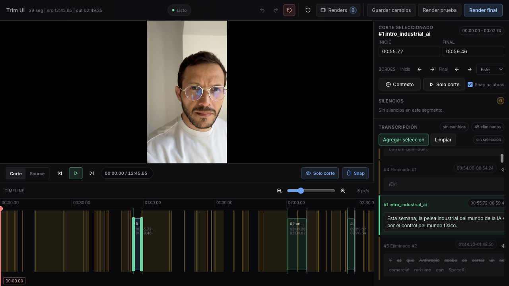
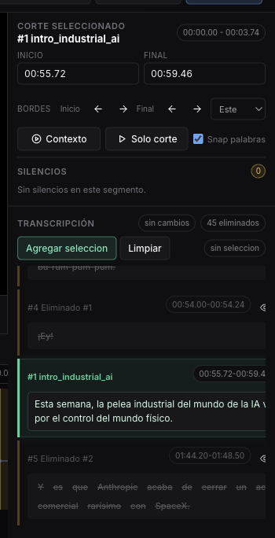
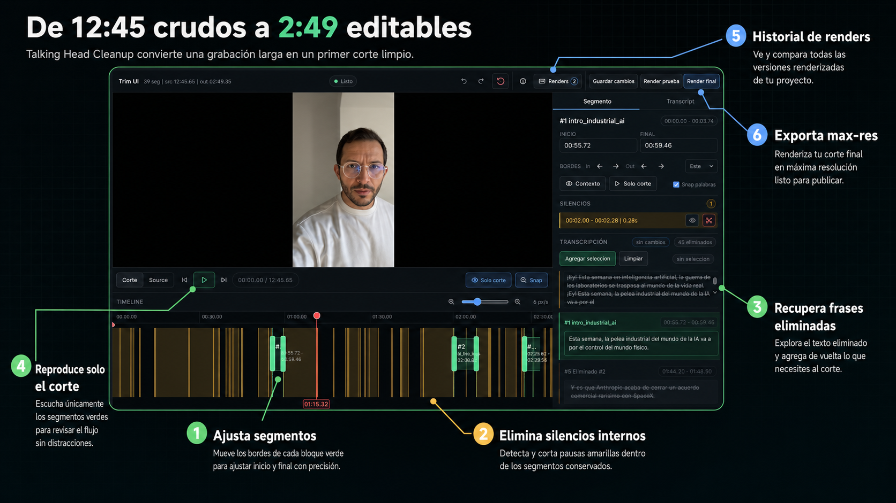

# Talking Head Trim

[](https://skills.sh/josecormane/talking-head-trim)

Local workflow for cleaning raw talking-head recordings before vertical video assembly.

It creates a transcript-aware edit packet, supports manual/external transcripts or transcription APIs, serves an interactive trim UI, and renders the final cut without uploading source video except when an API transcriber is selected.

## What It Looks Like

Start with a long raw recording and review the proposed cut on the original source timeline.



Use the side panel to inspect the selected segment, read surrounding transcript, and recover removed text when needed.



The interface is built for the cleanup pass before the main edit: adjust segments, remove internal silences, recover phrases, preview the cut, review renders, and export max-res.



## Requirements

- Node.js 20+
- `ffmpeg` and `ffprobe`
- Python 3 with `requests` only when using ElevenLabs Scribe
- Optional API key for one transcription provider:
  - `ELEVENLABS_API_KEY`
  - `OPENAI_API_KEY`
  - `GEMINI_API_KEY`

## Install

```bash
git clone https://github.com/josecormane/talking-head-trim.git
cd talking-head-trim
cp .env.example .env
npm test
```

## Prepare A Cut Packet

External transcript, no API call:

```bash
npm run talking-head:prepare -- \
  --edit-dir ./runs/demo/presenter_edit \
  --source /path/to/raw-video.mov \
  --mode tight_reel \
  --max-duration none \
  --transcript ./examples/external-transcript.example.json
```

OpenAI Whisper:

```bash
npm run talking-head:prepare -- \
  --edit-dir ./runs/demo/presenter_edit \
  --source /path/to/raw-video.mov \
  --mode tight_reel \
  --max-duration 03:00 \
  --transcriber openai \
  --language es
```

Provider options:

- `external`: import JSON with word timestamps.
- `openai`: uses `whisper-1` with word timestamps.
- `elevenlabs`: uses ElevenLabs Scribe through `tools/video-use/helpers/transcribe.py`.
- `gemini`: uses Gemini segment timestamps and estimates word timings for UI snapping.

Use `--force-transcribe` to replace a cached transcript.

## Review UI

After an EDL exists in the edit folder:

```bash
npm run talking-head:trim-ui -- \
  --edit-dir ./runs/demo/presenter_edit \
  --port 4377
```

Open `http://127.0.0.1:4377/`.

## Render

```bash
npm run talking-head:render-final -- \
  --edit-dir ./runs/demo/presenter_edit
```

## Install As A Skill

```bash
npx skills add josecormane/talking-head-trim
```

If the installer asks for a specific skill, use:

```bash
npx skills add josecormane/talking-head-trim --skill talking-head-cleanup
```

## Development

```bash
npm test
```

The test suite does not call paid transcription APIs. It validates external transcript import, cache behavior, force regeneration, and segment fallback.
